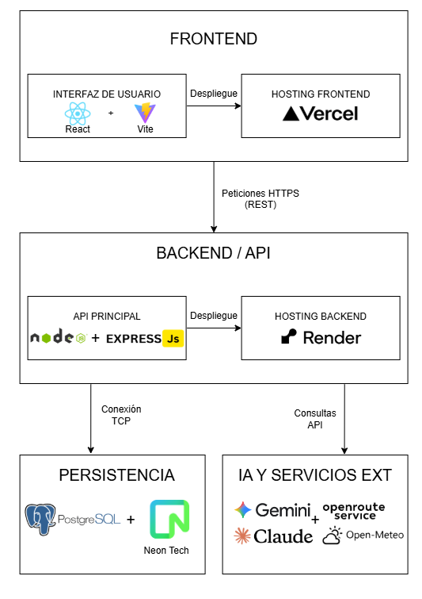

# RouteRobots

**Plataforma SaaS para la evaluación inteligente de rutas para robots autónomos de reparto.**

La planificación de entregas con robots terrestres enfrenta un desafío crítico: factores determinantes como la pendiente del terreno, el clima y la autonomía de la batería se encuentran dispersos en múltiples servicios, dificultando la elección de trayectos seguros. **RouteRobots** centraliza esta toma de decisiones en una herramienta de planificación. 

El diferencial de la plataforma es su motor de **Inteligencia Artificial integrado mediante MCP (Model Context Protocol)**. En lugar de mostrar datos crudos, la IA consulta APIs externas en tiempo real (clima, mapas, elevación), cruza esa información con el perfil del robot y emite un veredicto fundamentado: ruta apta, apta con supervisión o no recomendada, estimando los riesgos y el consumo de batería.

**Alcance del MVP y Usuarios Objetivo:**
El producto inicial está enfocado como una herramienta de software puro (sin control de hardware) con un *sandbox* operativo en Washington D. C., orientado a:
- Empresas de logística y flotas de reparto autónomo.
- Universidades y centros de investigación tecnológica.

## Stack Tecnológico
- **Frontend:** React y TypeScript (Despliegue en Vercel)
- **Backend y MCP:** Node.js con Express
- **Base de datos:** PostgreSQL (Neon.tech / Serverless)
- **Mapas, Rutas y Clima:** OpenStreetMap, OpenRouteService y Open-Meteo
- **Cloud & Infraestructura:** Arquitectura distribuida usando PaaS/Serverless
- **CI/CD:** GitHub Actions
- **Observabilidad:** Sentry y Application Logs

## Checkpoint 1

### Entorno de Despliegue
- **Backend API (Health Check):** [https://route-robots-api.onrender.com/api/health]

*(Nota: Estoy usando el plan gratuito, entonces en la primera petición el servicio puede tardar unos 50 segundos para despertar, pero las siguientes serán instantáneas).*

### Diagrama de Arquitectura Cloud
